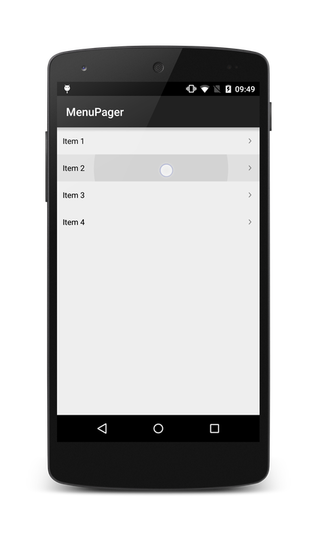
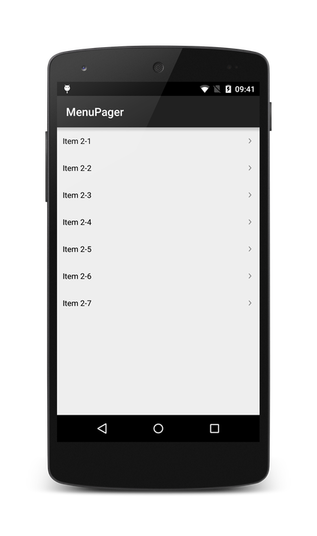

Android MenuPager
=================

Android widget that allows to paginate a hierarchical menu in a simple and customizable way

 

### Download

Clone the repository and import as Android Library in eclipse or grab via maven or gradle:

##### Maven

```xml
<dependency>
    <groupId>To be defined</groupId>
    <artifactId>To be defined</artifactId>
    <version>(insert latest version)</version>
</dependency>
```
##### Gradle
```groovy
dependencies {
   compile 'To be defined'
}
```
### Usage

*For a working implementation of this project see the `sample/` folder.*

Create your custom class that represents a menu item and decorate it with annotations provided by MenuPager library

```java
public class MenuItem implements Parcelable {
	@Collection
    private ArrayList<MenuItem> entries;
    @Label
    private String label;
}
```

Add an instance of MenuPager in your layout

```xml
<com.github.lquiroli.menupager.widget.MenuPager
        android:id="@+id/menu_pager"
        android:layout_width="match_parent"
        android:layout_height="match_parent" />
```

Create a custom fragment that will display a menu page. How to pass data to the Fragment is up to you but the usage of ``` Parcelable ``` interface is recommended

```java
public class MenuFragment extends Fragment {

    public static final String BUNDLE_DATA = "data";
    private ArrayList<MenuItem> mData;

    @Override
    public void onCreate(Bundle savedInstanceState) {
        super.onCreate(savedInstanceState);
        //We read the parcelable data
        mData = getArguments().getParcelableArrayList(BUNDLE_DATA);
    }

    @Nullable
    @Override
    public View onCreateView(LayoutInflater inflater, ViewGroup container, Bundle savedInstanceState) {

        //We create the layout
        RecyclerView view = new RecyclerView(getActivity());
        view.setHasFixedSize(true);
        view.setAdapter(new SimpleMenuRecyclerAdapter(mData));
        view.setLayoutManager(new LinearLayoutManager(getActivity()));

        return view;

    }
}
```

Extend ```SimpleMenuFragmentAdapter ``` and provide your custom fragment

```java
public class MyFragmentAdapter extends SimpleMenuFragmentAdapter {

    public MyFragmentAdapter(FragmentManager fm, ArrayList items) {
        super(fm, items);
    }

    @Override
    protected Fragment getPage(int pageIndex, ArrayList data) {

        MenuFragment fragment = new MenuFragment();
        Bundle bundle = new Bundle();
        bundle.putParcelableArrayList(MenuFragment.BUNDLE_DATA, data);
        fragment.setArguments(bundle);

        return fragment;
    }

}
```
In your activity, lookup your MenuPager instance and provide it your custom Adapter. In the following code variable ```mItems``` represents the collection of data (```ArrayList```) for the menu

```java
mMenuPager = (MenuPager) findViewById(R.id.menu_pager);
        menuAdapter = new MyFragmentAdapter(getSupportFragmentManager(), mItems);
        mMenuPager.setAdapter(menuAdapter);
```

### Customization

You can freely customize your page layout inside the Fragment ```onCreateView``` as long as you provide an instance of ```RecyclerView```.
To implement a custom adapter for the RecyclerView, create your own class that extends ```MenuPager.Adapter``` instead of using ```SimpleMenuRecyclerAdapter```.

You can customize the in and out animation of every page inside MenuPager by overriding methods ```onForwardAnimation``` and ```onBackwardAnimation``` inside your fragment adapter.

Use ```setOnMenuItemClickListener``` , ```setOnMenuPageChangeListener```  and ```setOnMenuAdapterChangeListener``` on your MenuPager instance to receive useful callbacks
## License

    Copyright 2015 Lorenzo Quiroli

    Licensed under the Apache License, Version 2.0 (the "License");
    you may not use this file except in compliance with the License.
    You may obtain a copy of the License at

        http://www.apache.org/licenses/LICENSE-2.0

    Unless required by applicable law or agreed to in writing, software
    distributed under the License is distributed on an "AS IS" BASIS,
    WITHOUT WARRANTIES OR CONDITIONS OF ANY KIND, either express or implied.
    See the License for the specific language governing permissions and
    limitations under the License.
